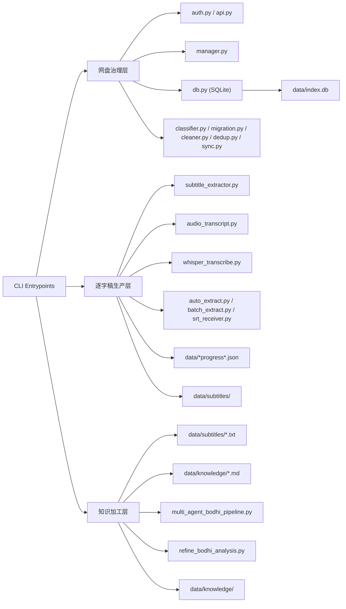
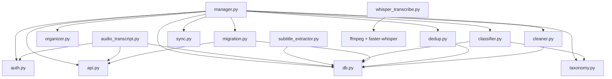
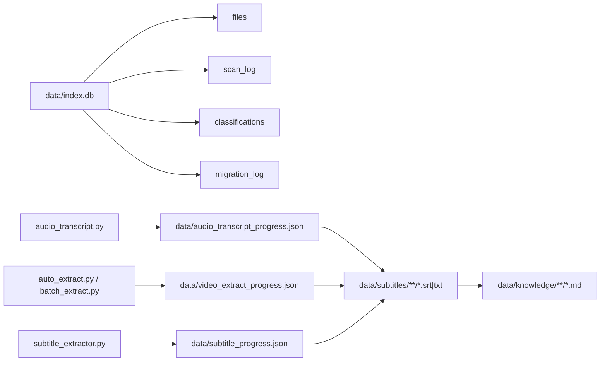
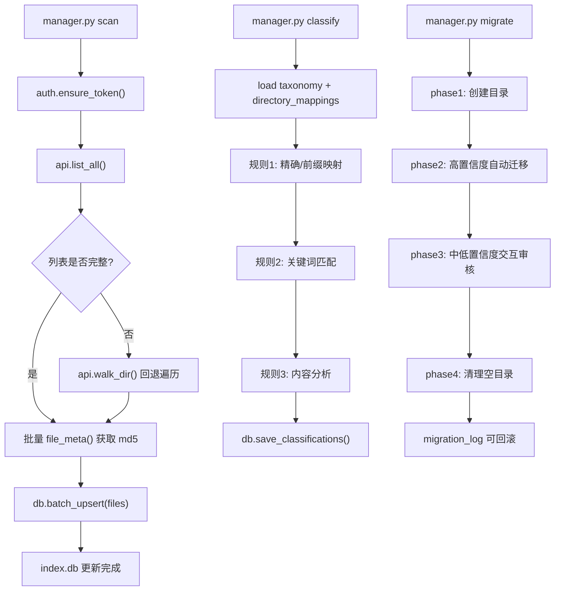
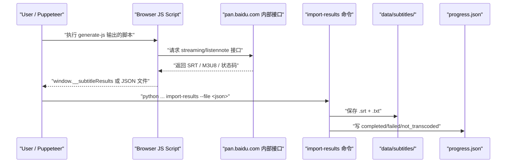
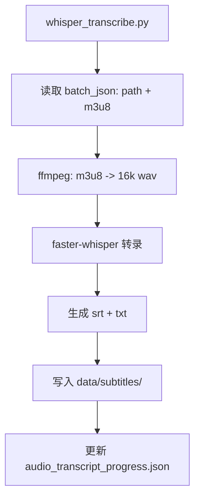
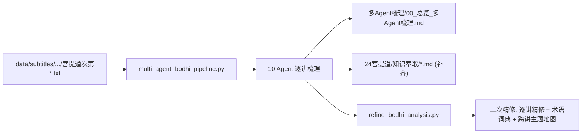

# baidu-netdisk-manager 架构图版

生成时间：2026-02-19  
用途：配合 `PROJECT_REPORT.md` 快速理解系统结构、数据流和执行流程。

## 1. 系统总览

## 2. 主模块依赖图

## 3. 数据层结构

## 4. 网盘治理流程（scan -> classify -> migrate）

## 5. 逐字稿生产流程（浏览器态抓取）

## 6. Whisper 流式转写流程（M3U8）

## 7. 菩提道专题加工流程（新增）

## 8. 运行建议（架构视角）

1. 先稳定 `scan -> classify -> migrate` 主链，再扩大逐字稿批量任务。
2. 将“浏览器抓取”和“本地加工”明确分层，避免耦合在一个脚本里。
3. 对 `data/*progress*.json` 建立定期快照，防止中断后状态污染。
4. 大规模文本加工前先做目录级 dry-run，降低误写风险。

